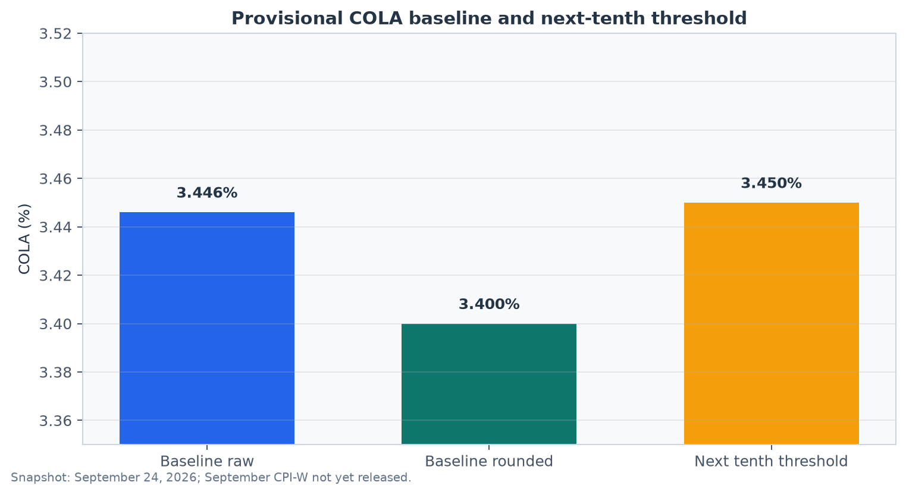
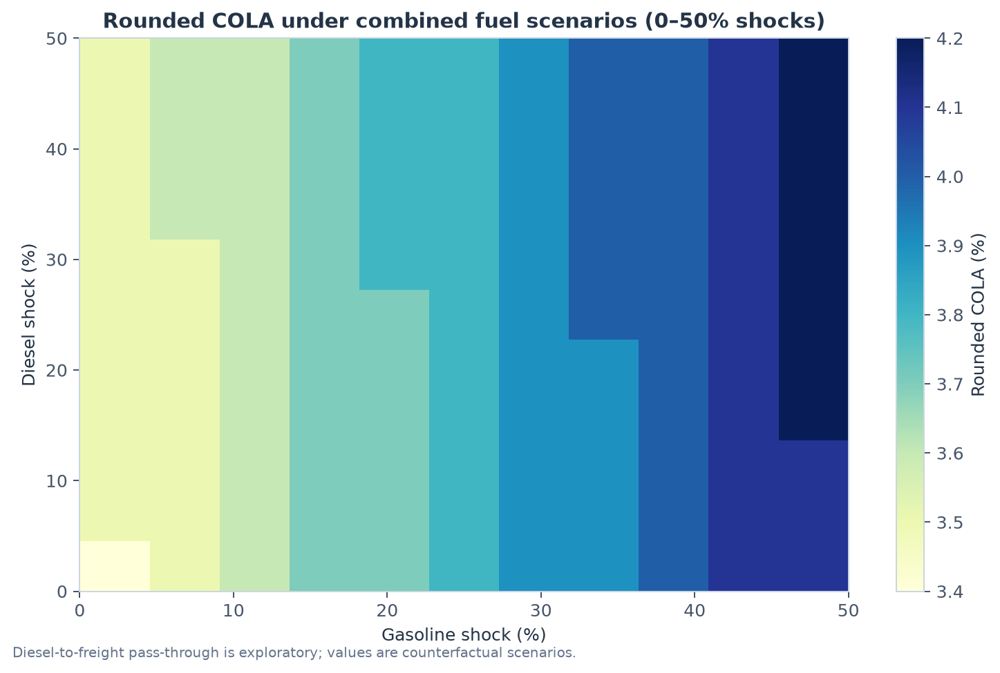
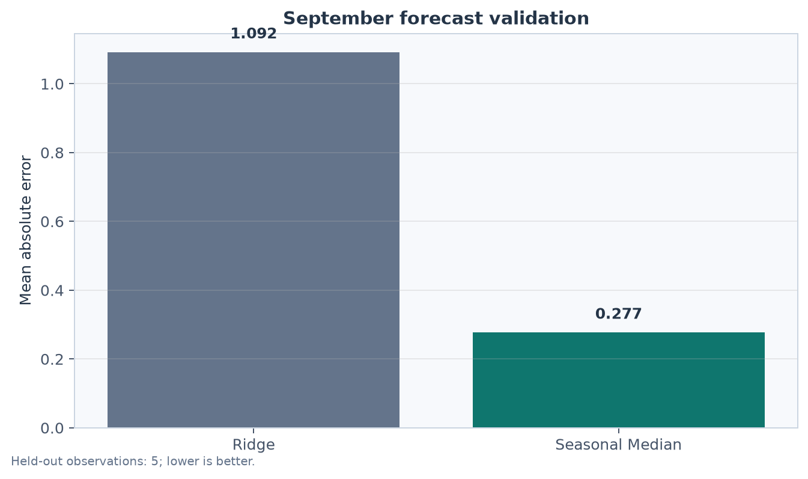

# Social Security COLA Fuel-Price Sensitivity

[](https://github.com/brockjohnson138/cola-fuel-price-sensitivity/actions/workflows/ci.yml)

This project asks a practical planning question: **how large would a gasoline or diesel-related price shock need to be to move the next Social Security COLA threshold?** It uses official BLS CPI-W and PPI series, applies SSA's published third-quarter arithmetic, and separates direct fuel-weight counterfactuals from an exploratory diesel-to-freight-to-consumer pass-through channel.

## Executive summary

The repository contains a reproducible **pre-release snapshot dated September 24, 2026**. September 2026 CPI-W was not yet available when this snapshot was created, so the results below are provisional scenarios rather than an official COLA estimate.

| Snapshot result | Estimate |
| --- | ---: |
| Baseline raw COLA before final September CPI-W | **3.446%** |
| Baseline COLA after SSA-style one-time rounding | **3.4%** |
| Raw threshold for the next tenth (3.5%) | **3.450%** |
| Diesel-only shock in the extended pass-through scenario | **3.22%** |
| Approximate diesel price in that scenario | **$5.73/gal** |

The diesel result is a sensitivity estimate, not a prediction. It combines a direct CPI-W fuel-weight effect with a historical, lagged Ridge pass-through model from diesel prices to truck-transportation PPI and then to nonfuel consumer prices. Actual freight contracts, competition, timing, fuel efficiency, and other prices can produce a different result.







## Why this project is useful

The analysis demonstrates how to turn a public-policy formula into a decision-support tool:

- implement SSA's third-quarter COLA calculation without double rounding;
- acquire and document official economic series;
- forecast a missing September observation transparently;
- compare a simple seasonal baseline with a Ridge benchmark;
- translate fuel-basket weights into counterfactual thresholds; and
- show where an exploratory pass-through model adds assumptions rather than certainty.

## Method

1. Pull or reuse a dated BLS snapshot for CPI-W all-items, core, motor fuels, gasoline, other motor fuels, gasoline and diesel prices, and truck-transportation PPI.
2. Estimate September CPI-W with the historical median September-over-August change when the official September value is unavailable.
3. Calculate the Q3 2026 average and compare it with the Q3 2025 base used for the 2027 COLA.
4. Apply the December 2025 BLS relative-importance shares for gasoline (3.971%) and other motor fuels (0.107%) to direct counterfactual scenarios.
5. Estimate an exploratory two-stage lagged Ridge channel from diesel prices to trucking costs to nonfuel consumer prices.
6. Export threshold tables, shock grids, validation metrics, and a manifest describing the source series and data limitations.

The simple forecast is intentionally retained as the primary baseline. In the saved historical comparison, the seasonal median has lower mean absolute error than the Ridge benchmark (0.277 versus 1.092 across five held-out September observations). The small validation sample is reported so the result is not presented as a broad model-performance claim.

## Reproduce the analysis

```bash
python -m venv .venv
source .venv/bin/activate
python -m pip install -r requirements.txt
python run_pipeline.py
python scripts/make_figures.py
python -m pytest -q
```

The default run uses the committed BLS snapshot for reproducibility. Use `python run_pipeline.py --refresh` to request current BLS data when the September 2026 release is available. The refresh command should be rerun after checking the release date and reviewing the resulting manifest.

## Repository map

```text
src/                  acquisition, preparation, forecasting, analysis, pass-through model
data/                 dated raw snapshot, processed series, and provenance manifests
outputs/              threshold tables, scenario grids, diagnostics, and summary JSON
docs/EVIDENCE.md      definitions, sources, and limitations
docs/PORTFOLIO.md     concise portfolio framing
docs/figures/         generated figures used in this README
scripts/              reproducible figure generation
tests/                arithmetic and model-behavior tests
```

Important outputs:

- [`scenario_summary.json`](outputs/scenario_summary.json) — headline estimates and model diagnostics;
- [`extended_cola_thresholds.csv`](outputs/extended_cola_thresholds.csv) — diesel thresholds after the exploratory pass-through channel;
- [`extended_fuel_shock_grid.csv`](outputs/extended_fuel_shock_grid.csv) — combined gasoline/diesel scenarios;
- [`forecast_validation_metrics.csv`](outputs/forecast_validation_metrics.csv) — baseline versus Ridge comparison; and
- [`data_manifest.json`](data/processed/data_manifest.json) — series IDs, last observations, and availability notes.

## Data, evidence, and limitations

The project uses definitions and source links from the [Social Security Administration](https://www.ssa.gov/cola/), [BLS CPI documentation](https://www.bls.gov/cpi/factsheets/cpi-series-ids.htm), [BLS motor-fuel methodology](https://www.bls.gov/cpi/factsheets/motor-fuel.htm), and [BLS PPI databases](https://www.bls.gov/ppi/databases/). See [`docs/EVIDENCE.md`](docs/EVIDENCE.md) for the full evidence register.

This project does not claim that fuel prices alone determine the COLA. It does not estimate a structural causal model. The direct diesel calculation is a proxy because BLS's “other motor fuels” component includes automotive diesel and alternative motor fuels. The pass-through sample is relatively short, and its current diagnostics are in-sample; expanding-window validation and uncertainty intervals are appropriate next improvements.

## Portfolio framing

See [`docs/PORTFOLIO.md`](docs/PORTFOLIO.md) for a concise description suitable for a resume, LinkedIn, or project index.
